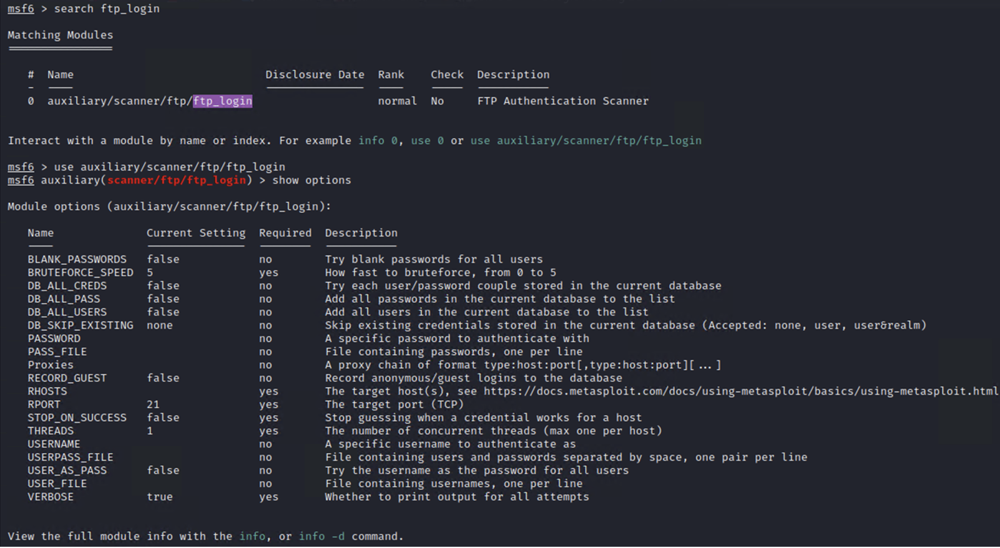
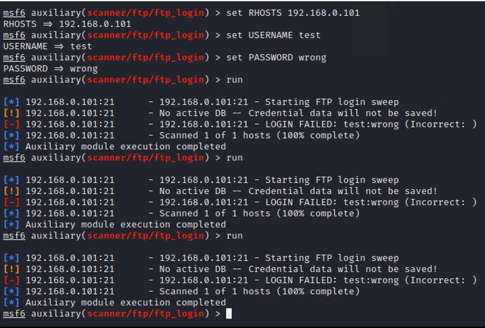
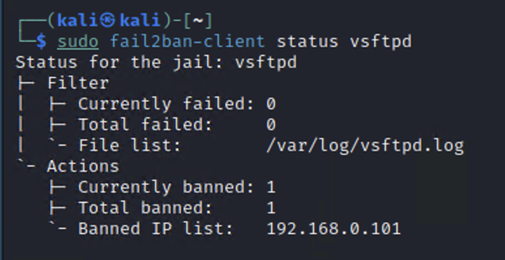

# Fail2Ban Brute Force Attack Prevention

This project demonstrates how a brute-force attack against an FTP server can be simulated using Metasploit and automatically blocked using Fail2Ban on a Linux system.

## Objective

The goal of this project is to simulate a brute-force login attack and implement an automated defense mechanism that detects repeated failed login attempts and blocks the attacker's IP address.

## Tools Used

- Kali Linux
- Metasploit Framework
- Fail2Ban
- vsftpd (FTP server)
- iptables firewall

---

## Attack Setup

The Metasploit auxiliary module `ftp_login` was used to simulate a brute-force attack against the FTP server.

---

## Brute Force Attack Simulation

The attack was executed by attempting multiple incorrect login credentials against the target FTP service.

---

## Fail2Ban Blocking the Attacker

Fail2Ban monitored the FTP logs and automatically banned the attacking IP address after multiple failed login attempts.

---

## Results

- Multiple failed login attempts were detected.
- Fail2Ban successfully identified the attack pattern.
- The attacker's IP address was automatically banned.
- The FTP service was protected from further brute-force attempts.

---

## Skills Demonstrated

- Linux security administration
- Brute-force attack simulation
- Log monitoring and analysis
- Intrusion prevention using Fail2Ban
- Security testing using Metasploit
